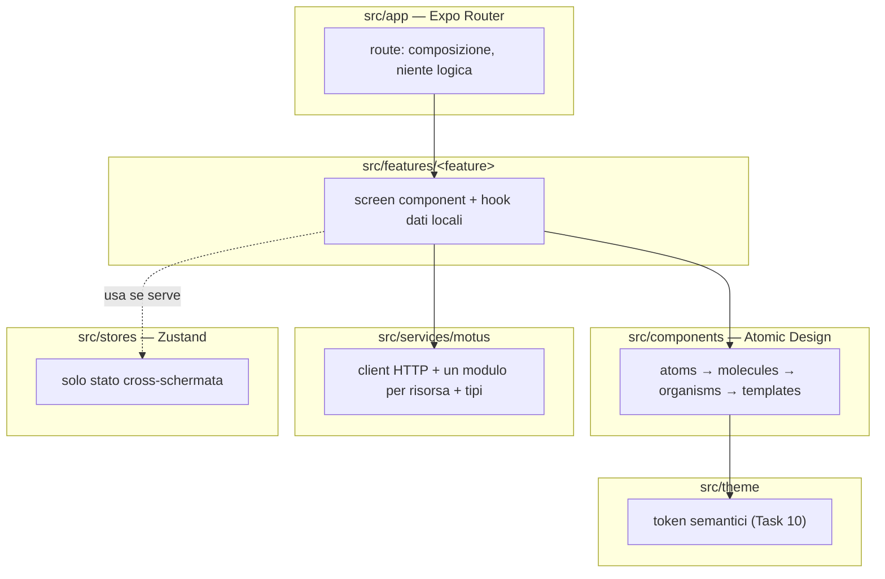
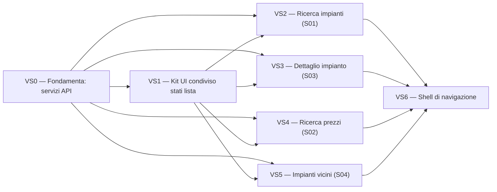

# Motus — Architettura applicativa

## Fonti e perimetro

Documento di sintesi che traduce i deliverable dei Task 1–5 in decisioni architetturali per `Motus-frontend`:

| Task | Documento                                                                               | Cosa fornisce a questa architettura                                                                      |
| ---- | --------------------------------------------------------------------------------------- | -------------------------------------------------------------------------------------------------------- |
| 1    | `repository-audit.md`                                                                   | Stato reale del repository: bootstrap Expo, struttura cartelle già scaffoldata, debiti tecnici noti      |
| 2    | `product-requirements.md`, `domain-model.md`, `screen-inventory.md`, `user-flows.md`    | Casi d'uso confermati (UC1–UC7), entità, 4 schermate ipotizzate (S01–S04), tutte marcate come assunzione |
| 3    | `api-contract.md`, `api-discrepancies.md`, `api-screen-mapping.md`, `open-questions.md` | Contratto API verificato dal vivo, incongruenze reali da isolare lato client                             |
| 4    | `mcp-audit.md`, `design-inputs.md`                                                      | Nessun design system definitivo disponibile; token attuali dichiarati provvisori                         |
| 5    | `automotive-feasibility.md`, `automotive-architecture-decision.md`                      | Stato per piattaforma automotive, nessuna implementazione esistente                                      |

Questo documento **non introduce nuovi requisiti**: ogni scelta è motivata da uno dei documenti sopra o da un vincolo esplicito del Task 6. Le decisioni architetturalmente significative sono tracciate come ADR in `docs/motus/adr/`.

## 0. Principi guida

1. **Nessuna feature applicativa esiste oggi.** Il repository è un bootstrap Expo (Expo Router, NativeWind, Zustand, Atomic Design scaffolded ma vuoto oltre `AppText` e uno store dimostrativo) — vedi `repository-audit.md`.
2. **Il backend è di sola lettura, senza autenticazione, senza contratto versionato** (`api-contract.md`). Il client deve **isolare** le incoerenze note del contratto (nomi di campo diversi, forme diverse tra endpoint), non propagarle nella UI o nei tipi applicativi.
3. **Il design non è finalizzato.** I token in `src/theme/tokens.js` sono dichiarati esplicitamente provvisori; il riferimento "Stitch design analysis" nel codice è irrisolto (`design-inputs.md`, `mcp-audit.md`). L'architettura non deve dipendere da un design system che non esiste ancora, né bloccarsi in sua attesa.
4. **L'automotive non è implementato e non deve accoppiare l'architettura mobile.** Android Auto è `feasible-with-native-work`, CarPlay `requires-product-clarification` (`automotive-architecture-decision.md`) — nessuna delle due comporta oggi codice, dipendenze o vincoli di design sull'app mobile.
5. **Vincoli espliciti di questo task**: nessuna feature implementata, nessuna nuova dipendenza, nessuna schermata definitiva, nessuna architettura speculativa o sproporzionata rispetto a 4 casi d'uso confermati.

## 1. Architettura applicativa (vista d'insieme)

Architettura a livelli, organizzata per vertical slice all'interno del livello "feature". Ogni livello dipende solo da quelli sottostanti, mai il contrario.

Regola di dipendenza: `app` → `features` → (`components` + `services` + `stores`) → `theme`. I componenti condivisi non chiamano mai `services` direttamente (principio già enunciato nel `README.md` attuale, qui reso vincolante); i dati arrivano ai componenti presentazionali solo tramite prop passate dalla feature.

## 2. Organizzazione per feature

- `src/app/*`: solo route e composizione di navigazione (`Stack`/eventuali gruppi). Nessuna logica di business, nessuna chiamata di rete diretta.
- `src/features/<nome-feature>/`: screen component principale, hook dati specifici della feature (es. `useStationsSearch`), eventuali sotto-componenti privati non riutilizzati altrove.
- **Promozione a `src/components`** quando un componente serve a ≥ 2 feature (regola oggettiva, evita di indovinare in anticipo cosa sarà condiviso).
- **Nessuna feature importa da un'altra feature.** Se due feature devono condividere qualcosa, quel qualcosa si sposta in `components`, `services`, `hooks` o `stores` condivisi. Questo mantiene ogni vertical slice sviluppabile e testabile in isolamento (requisito esplicito del Task 6).

## 3. Componenti condivisi (Atomic Design)

La struttura `atoms/molecules/organisms/templates` è già scaffoldata (vuota oltre `AppText`) e viene mantenuta:

- **atoms**: elementi senza conoscenza del dominio Motus (testo, bottone, campo di input, indicatore di caricamento). Introdotti solo quando una feature li richiede realmente — non pre-costruiti (coerente con l'osservazione "yagni" già presente in `repository-audit.md`).
- **molecules**: composizioni con una singola responsabilità di presentazione dati (es. una riga risultato, un badge prezzo, un campo filtro). I nomi definitivi **non** sono fissati in questo documento — sarebbe design di schermata, escluso dal perimetro del Task 6.
- **organisms**: blocchi con stato locale di presentazione (es. una lista che sa mostrare i propri stati vuoto/caricamento/errore, una barra filtri). Gli organism ricevono dati e callback via prop, non chiamano `services`.
- **templates**: composizione di organism per una _forma_ di schermata. Le quattro schermate ipotizzate condividono solo due forme reali: "lista con filtri e paginazione" (S01, S02, S04) e "dettaglio" (S03) — vedi §7.

Nessun componente condiviso importa da `src/services` o `src/features`. Questo è verificabile con una regola di lint sui path di import quando la prima feature reale sarà introdotta (non oggi: sarebbe una modifica di tooling non richiesta da questo task).

## 4. Design system

- **Aggiornato dal Task 10**: token semantici tipizzati in `src/theme/tokens.ts`, dettagliati in [`design-tokens.md`](./design-tokens.md). I valori restano provvisori dove il brand non ha ancora deciso (`danger`/`warning`/`success`, `brand-guidelines.md` §4), ma la struttura (nomi semantici, stati, fonte unica) non è più un placeholder.
- **Decisione architetturale**: i componenti condivisi consumano esclusivamente token semantici via NativeWind (`bg-background`, `text-foreground`, `text-primary`, ecc.), mai valori hardcoded. In questo modo, quando il design sarà chiarito (risoluzione del riferimento "Stitch", o altro processo di design), la sostituzione avviene in `tokens.ts`/`tailwind.config.js` senza toccare i componenti.
- Nessuna strategia di dark mode esplicita è definita ora: non c'è un requisito raccolto in `product-requirements.md`. L'architettura non la preclude (`expo-system-ui` è già configurato con `userInterfaceStyle: "automatic"`) e `design-tokens.md` §6 ne documenta il percorso di estensione (nessuno store globale necessario, NativeWind legge lo schema colore nativo).
- **Debito risolto dal Task 10**: la duplicazione tra `tokens.js` (runtime) e `tokens.d.ts` (dichiarazione manuale) segnalata qui è stata eliminata — `tokens.ts` è ora l'unico file, nativamente tipizzato (`design-tokens.md` §1).

## 5. Servizi API

- Un client HTTP minimo in `src/services/motus/client.ts`: usa `fetch` nativo (nessuna libreria HTTP aggiunta), legge la base URL da `EXPO_PUBLIC_API_URL` (dichiarata ma non ancora letta dal codice — `repository-audit.md`), centralizza il parsing delle **tre forme di risposta** documentate in `api-contract.md`: successo 200 JSON, errore applicativo `{"error": string}` (400/404/500), errore di metodo HTML/501 (non dovrebbe mai verificarsi con un client conforme che usa solo `GET`).
- Un modulo per risorsa, in corrispondenza 1:1 con gli endpoint applicativi realmente consumati da una schermata (`api-screen-mapping.md`): `stations.ts` (`search`, `getById`, `nearby`), `prices.ts` (`search`). `GET /health` **non** ha un modulo cliente dedicato: nessuna schermata lo consuma (`screen-inventory.md`, "Schermate volutamente escluse").
- Tipi TypeScript in `src/services/motus/types.ts`, derivati campo per campo da `api-contract.md`, con nullability esplicita dove osservata dal vivo (`latitudine`/`longitudine`, `via_geocoded`, `geocoding_status`, `data_comunicazione`, `nome_impianto` può essere stringa vuota, `prices` può essere `[]`).
- **Normalizzazione lato client delle incoerenze note** (vedi ADR-0001): il campo totale di paginazione (`total` vs `total_available`) viene esposto ai consumer come un solo tipo `Pagination` client-side. Al contrario, `Station` (S01/S03/S04) e `PriceRow` (S02) **restano due tipi distinti**, perché lo sono realmente nella risposta del server (`api-screen-mapping.md`, nota finale) — non si forza un tipo unico artificiale dove il contratto non lo giustifica.

## 6. Strategia di gestione dello stato

- **Stato locale** (`useState`/`useReducer` dentro l'hook della feature) per: filtri di una singola schermata, stato di richiesta (idle/loading/success/error) di una singola chiamata. Non promosso a Zustand per default.
- **Zustand riservato a stato realmente condiviso tra ≥ 2 schermate** (es. l'ultima posizione geografica nota, utile sia a S04 sia a un eventuale badge globale) — nessuno store creato preventivamente prima che una feature lo richieda davvero (ADR-0004).
- **Nessuna libreria di data-fetching/cache** (React Query, SWR, ecc.) introdotta ora: vincolo esplicito "nessuna nuova dipendenza" del Task 6, e i 4 casi d'uso confermati non hanno requisiti di cache complessi (dati sostituiti integralmente ad ogni import server-side, nessuna mutazione client). I dati server sono letti da hook dedicati per risorsa (es. `useStationsSearch`) che incapsulano `fetch` + stato; questo isola la futura introduzione di una libreria di cache dentro `src/hooks`/`src/services`, senza doverla spargere nelle schermate (ADR-0002).
- Lo store dimostrativo `useAppStore`/`isAppReady` resta fino a quando la prima feature reale non introduce il primo stato condiviso vero — la sua rimozione è un'attività di implementazione, non di questo task di pianificazione.

## 7. Routing mobile

- Expo Router (file-based, `src/app`), già configurato con uno `Stack` radice e `headerShown: false`.
- I 4 casi d'uso confermati condividono solo **due forme**: "lista con filtri e paginazione" (S01, S02, S04) e "dettaglio" (S03). La struttura di route rispecchia questa realtà, non quattro disegni indipendenti.
- **Composizione di navigazione tra i punti di ingresso** (tab bar vs stack singolo) non è decisa in dettaglio qui: sarebbe già una scelta di informazione-architettura/UI, esclusa dal perimetro ("nessuna schermata definitiva"). Principio adottato (ADR-0005): iniziare con la forma più semplice che serve la prima vertical slice (route singola), aggiungere un livello di navigazione tra punti di ingresso solo quando esistono realmente ≥ 2 schermate di ingresso da collegare.
- S03 (dettaglio) è raggiunto da una route dinamica singola (parametro `id_impianto`), mai duplicata per provenienza (S01, S02 o S04 puntano tutte alla stessa route).

## 8. Capability di piattaforma

- **Geolocalizzazione**: richiesta solo da S04 (`nearby`). Nessuna libreria di geolocalizzazione è installata oggi. L'aggiunta di `expo-location` (o equivalente ufficiale Expo SDK 54) è rimandata all'inizio della vertical slice che implementa S04 — è l'**unico punto pianificato** in cui questo backlog prevede una nuova dipendenza, e non viene aggiunta in questo task.
- Nessun'altra capability nativa è richiesta da alcun requisito raccolto: niente notifiche push, camera, storage sicuro, biometria (`screen-inventory.md` non le prevede, `product-requirements.md` §13 le elenca esplicitamente come fuori scopo).
- Permessi previsti: solo posizione in foreground. Nessun uso in background è documentato (`product-requirements.md` §10).

## 9. Confini tra mobile e automotive

- Android Auto e CarPlay richiedono superfici native separate (`CarAppService` Kotlin/Java, `CPTemplateApplicationSceneDelegate` Swift): **nessuna UI React Native è renderizzabile lì** (`automotive-architecture-decision.md`).
- **Cosa è condivisibile in linea di principio**: solo il layer di contratto dati (`src/services/motus`, i tipi TypeScript come riferimento concettuale per l'equivalente nativo) — non il codice React Native, non i componenti, non lo stato Zustand, non il routing.
- **Questa architettura non assume né blocca un futuro target automotive**: nessuna decisione qui dipende da Android Auto/CarPlay, e nessuna riga di codice o dipendenza automotive è pianificata in `feature-backlog.md` (ADR-0003).
- Prerequisiti prima di qualunque lavoro automotive reale (non pianificati in questo task): uscita dal workflow Expo Managed per il target Android interessato (`prebuild`), config plugin dedicato, e una decisione di prodotto su quali schermate portare in auto — solo S04 è concettualmente vicina alle regole driver-distraction, S01/S02 richiedono redesign (interazione vocale o uso "solo da fermo").

## 10. Dipendenze tra feature

Nessuna feature dipende da un'altra feature (solo da VS0/VS1, condivisi). VS2, VS3, VS4, VS5 sono sviluppabili in **qualunque ordine tra loro** una volta pronte VS0/VS1; l'ordine proposto in `feature-backlog.md` riflette priorità di prodotto (i casi d'uso meglio definiti prima), non un vincolo tecnico rigido, tranne per VS5 che richiede in più la capability di geolocalizzazione (§8).

## 11. Ordine di implementazione

Dettagliato per fasi in `docs/motus/implementation-plan.md`. In sintesi: fondamenta senza schermate (VS0, VS1) → prima vertical slice end-to-end (VS2) → dettaglio (VS3) → seconda via di ricerca (VS4) → capability nativa (VS5) → composizione di navigazione (VS6).

## 12. Strategia di testing

Dettagliata in `docs/motus/testing-strategy.md`. In sintesi: piramide adattata al progetto (statico → unit su servizi/normalizzazione → componenti RNTL → integrazione schermata con servizi mockati → store), nessun E2E introdotto ora (nessuna nuova dipendenza), fixture derivate dai casi reali osservati in `api-contract.md`.
